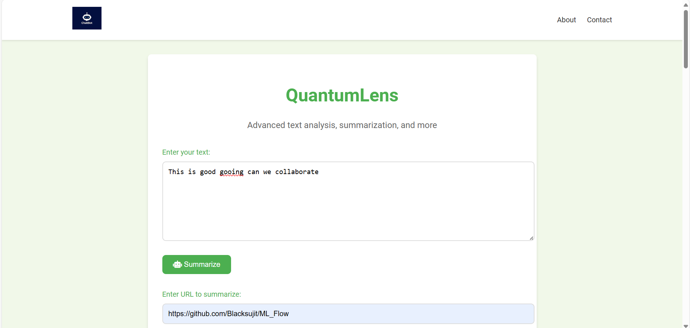
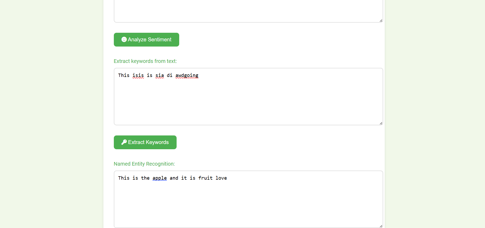
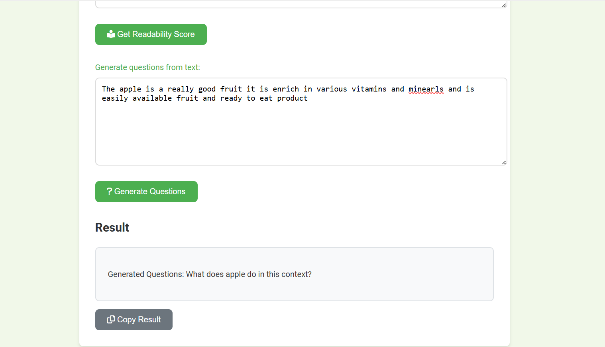

# 🚀 QuantumLens: Your All-in-One AI-Powered Information Assistant.

 
<div align="center">
  
</div>

<br>

# Project View:









## 📚 Table of Contents
1. [Introduction](#-introduction)
2. [Features](#-features)
3. [Why QuantumLens?](#-why-QuantumLens)
4. [Installation](#-installation)
7. [Research Inspiration](#-research-inspiration)
8. [Challenges Faced](#-challenges-faced)
9. [Contributing](#-contributing)
10. [License](#-license)

## 🌟 Introduction

QuantumLens is a cutting-edge, AI-powered information assistant designed to revolutionize how you interact with and process information. By leveraging advanced machine learning algorithms and natural language processing techniques, QuantumLens offers a suite of powerful tools to enhance your daily information consumption and analysis.

<br>


## 🎯 Features

### 1. Text Summarization
- **What it does**: Condenses long texts into concise summaries.
- **Why it's important**: Saves time and improves information retention by providing key points quickly.

### 2. URL Summarization
- **What it does**: Extracts and summarizes content from web pages.
- **Why it's important**: Allows quick understanding of web content without extensive reading.

### 3. Wikipedia Summary
- **What it does**: Fetches and summarizes Wikipedia articles on given topics.
- **Why it's important**: Provides quick, reliable information on a wide range of subjects.

### 4. Stock Information
- **What it does**: Retrieves real-time stock market data.
- **Why it's important**: Enables informed financial decision-making with up-to-date information.

### 5. Sentiment Analysis
- **What it does**: Analyzes the emotional tone of text.
- **Why it's important**: Helps understand public opinion and emotional context in communications.

### 6. Keyword Extraction
- **What it does**: Identifies the most important words or phrases in a text.
- **Why it's important**: Facilitates quick understanding of main topics and aids in content categorization.

### 7. Text Translation
- **What it does**: Translates text between different languages.
- **Why it's important**: Breaks down language barriers and enables global communication.

### 8. Currency Conversion
- **What it does**: Converts monetary values between different currencies.
- **Why it's important**: Simplifies financial calculations for international transactions.

### 9. Readability Scoring
- **What it does**: Assesses the complexity and readability of text.
- **Why it's important**: Helps in creating more accessible and understandable content.

### 10. Question Generation
- **What it does**: Automatically generates relevant questions from given text.
- **Why it's important**: Aids in learning and comprehension by promoting active engagement with content.

### 11. Named Entity Recognition
- **What it does**: Identifies and classifies named entities (e.g., person names, organizations) in text.
- **Why it's important**: Enhances text analysis and information extraction capabilities.

## 🌈 Why QuantumLens?

QuantumLens is not just another information tool; it's your personal AI-powered assistant designed to make your daily information processing tasks easier, faster, and more efficient. Here's why QuantumLens is indispensable for your day-to-day use:

1. **Time-Saving**: Quickly summarize long articles, reports, or web pages, saving hours of reading time.
2. **Enhanced Learning**: Generate questions from text to improve comprehension and retention of information.
3. **Financial Insights**: Stay updated with real-time stock information and easy currency conversions.
4. **Content Analysis**: Understand the sentiment and readability of your content to improve communication.
5. **Research Aid**: Quickly gather information on any topic with Wikipedia summaries and keyword extraction.
6. **Data Extraction**: Easily identify important entities in text for further analysis or categorization.

Whether you're a student, professional, researcher, or just someone who loves to stay informed, QuantumLens provides the tools you need to navigate the information age efficiently and effectively.

## 🛠 Installation

To get started with QuantumLens, follow these simple steps:

1. Clone this repository to your local machine:
   ```
   git clone https://github.com/yourusername/QuantumLens.git
   ```


2. Locate the `app.py` file in the project directory.

3. Run the `app.py` file from the same directory:
   ```
   python app.py
   ```

Make sure you have all the necessary dependencies installed before running the application. You may need to set up a virtual environment and install the required packages listed in the `requirements.txt` file (if provided).


## 📚 Research Inspiration

QuantumLens draws inspiration from several cutting-edge research papers in the fields of natural language processing and machine learning:

1. "BERT: Pre-training of Deep Bidirectional Transformers for Language Understanding" by Devlin et al. (2018) - [Link](https://arxiv.org/abs/1810.04805)
   - Inspired our approach to text understanding and named entity recognition.

2. "Text Summarization Techniques: A Brief Survey" by Allahyari et al. (2017) - [Link](https://arxiv.org/abs/1707.02268)
   - Provided insights for our text and URL summarization features.

3. "Neural Machine Translation by Jointly Learning to Align and Translate" by Bahdanau et al. (2014) - [Link](https://arxiv.org/abs/1409.0473)
   - Influenced our text translation implementation.

4. "Sentiment Analysis: Detecting Valence, Emotions, and Other Affectual States from Text" by Mohammad (2016) - [Link](https://arxiv.org/abs/1601.06971)
   - Guided our sentiment analysis feature development.

5. "Automatic Question Generation from Text" by Heilman and Smith (2010) - [Link](https://www.cs.cmu.edu/~mheilman/papers/heilman-smith-qg-tech-report.pdf)
   - Inspired our question generation functionality.

## 🧠 Cool Things to Know

1. **Adaptive Learning**: QuantumLens uses adaptive learning algorithms to improve its performance over time based on user interactions.

2. **Privacy-Focused**: We prioritize user privacy by implementing state-of-the-art encryption for all data processing.

3. **Customizable UI**: The interface can be customized to suit individual preferences, enhancing user experience.

4. **API Integration**: QuantumLens can be easily integrated with other applications through our robust API.

5. **Offline Mode**: Some features are available offline, ensuring functionality even without an internet connection.

## 🚧 Challenges Faced

During the development of QuantumLens, we encountered several challenges:

1. **Scalability**: Ensuring the system could handle multiple requests simultaneously without compromising performance.

2. **Accuracy**: Balancing speed and accuracy, especially in features like text summarization and sentiment analysis.


3. **Real-time Processing**: Optimizing algorithms for real-time processing of large text inputs.

4. **Integration**: Seamlessly integrating multiple AI models and APIs into a cohesive system.

These challenges were addressed through iterative development, extensive testing, and continuous optimization of our algorithms and infrastructure.

## 🤝 Contributing

We welcome contributions to enhance the functionality and capabilities of QuantumLens. Please refer to our contribution guidelines for information on how to submit improvements and bug fixes.

## 📄 License

MIT License
